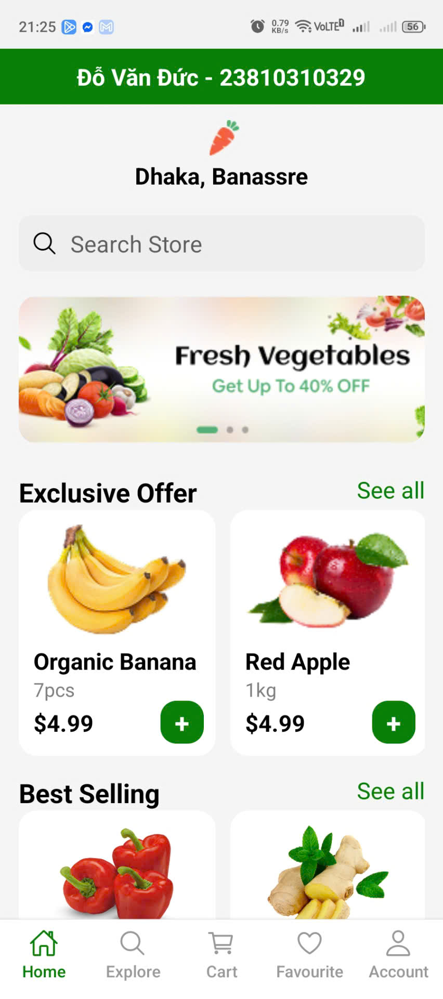
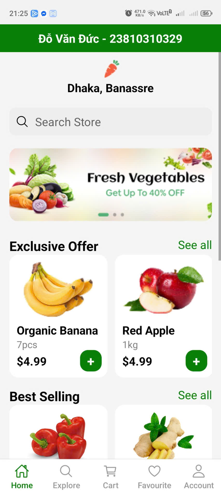
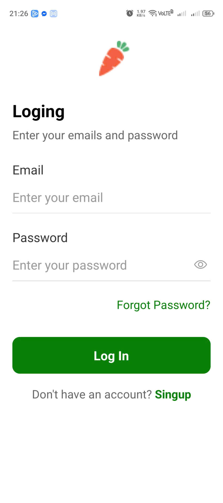
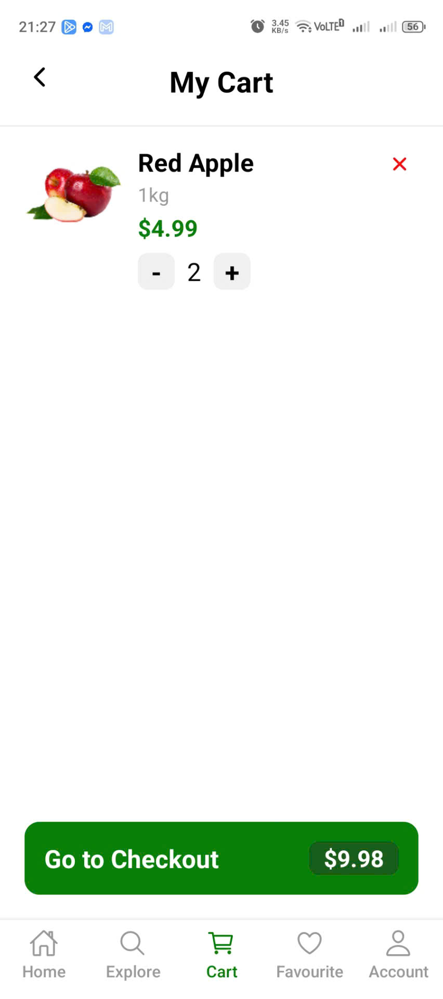
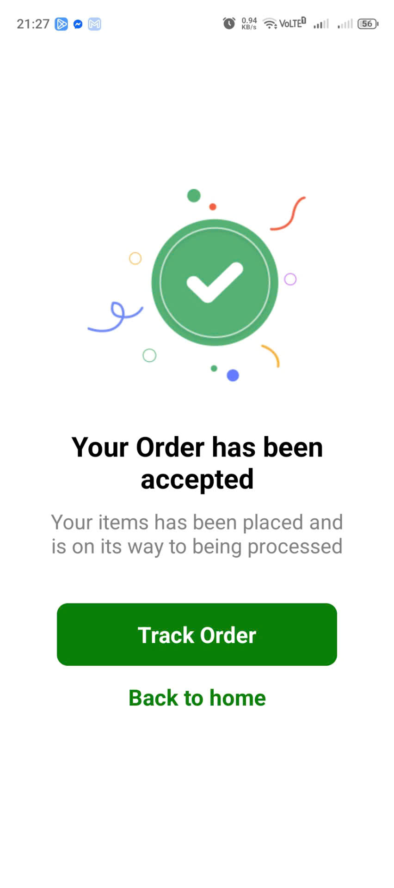
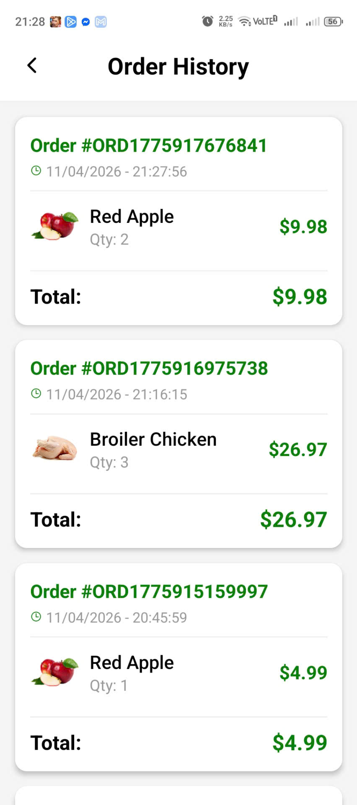

# Nectar App - Ứng dụng mua sắm trực tuyến

## Thông tin sinh viên
| Thông tin | Nội dung                        |
|-----------|---------------------------------|
| Họ và tên | Đỗ Văn Đức                      |
| MSSV      | 23810310329                     |
| Lớp       | CNPM5                           |
| Môn học   | Lập trình trên thiết bị di động |

## Mô tả ứng dụng
Nectar App là ứng dụng mua sắm trực tuyến chuyên về thực phẩm và đồ uống, được xây dựng bằng React Native và Expo. Ứng dụng cho phép người dùng:
- Đăng ký / Đăng nhập tài khoản
- Xem danh sách sản phẩm theo danh mục
- Tìm kiếm và lọc sản phẩm
- Thêm sản phẩm vào giỏ hàng
- Quản lý giỏ hàng (tăng/giảm số lượng, xóa sản phẩm)
- Đặt hàng và lưu lịch sử đơn hàng

## Chức năng chi tiết

### 1. Xác thực & Lưu đăng nhập
- ✅ Đăng ký tài khoản mới
- ✅ Đăng nhập với tài khoản đã đăng ký
- ✅ Lưu user và token vào AsyncStorage
- ✅ Tự động đăng nhập khi mở lại ứng dụng
- ✅ Đăng xuất xóa toàn bộ dữ liệu liên quan

### 2. Giỏ hàng
- ✅ Thêm sản phẩm vào giỏ từ nhiều màn hình
- ✅ Lưu giỏ hàng vào AsyncStorage
- ✅ Dữ liệu giỏ hàng được giữ nguyên khi reload app
- ✅ Tăng/Giảm số lượng sản phẩm
- ✅ Xóa sản phẩm khỏi giỏ

### 3. Đơn hàng
- ✅ Xác nhận đơn hàng trước khi đặt
- ✅ Lưu đơn hàng vào AsyncStorage
- ✅ Hiển thị danh sách đơn hàng với đầy đủ thông tin:
  - Sản phẩm (tên, số lượng, giá)
  - Tổng tiền
  - Thời gian đặt hàng

## Công nghệ sử dụng
- **React Native** - Framework xây dựng ứng dụng
- **Expo** - Platform phát triển và build
- **React Navigation** - Điều hướng giữa các màn hình
- **AsyncStorage** - Lưu trữ dữ liệu cục bộ

## Hướng dẫn cài đặt và chạy

### Yêu cầu
- Node.js >= 14.x
- npm hoặc yarn
- Expo CLI
- Điện thoại có cài Expo Go hoặc máy ảo Android/iOS

### Các bước chạy

# 1. Clone dự án
git clone https://github.com/ducdv06/nectar-app-2.git

# 2. Di chuyển vào thư mục dự án
cd nectar-app-2

# 3. Cài đặt dependencies
npm install

# 4. Chạy ứng dụng
npx expo start -c

STT	Chức năng	Ảnh minh họa
| 01 | Login thành công |  |
| 02 | Auto login |  |
| 03 | Logout |  |
| 04 | Thêm vào giỏ |  |
| 05 | Giỏ hàng sau reload |  |
| 06 | Thay đổi số lượng |  |
| 07 | Đặt hàng thành công |  |
| 08 | Danh sách đơn hàng |  |
| 09 | Đơn hàng sau reload |  |

1. AsyncStorage hoạt động như thế nào?
AsyncStorage là một hệ thống lưu trữ dữ liệu dạng key-value không đồng bộ, bền vững trên React Native.

Dữ liệu được lưu dưới dạng chuỗi JSON

Hoạt động bất đồng bộ (async/await) không block luồng chính

Trên iOS sử dụng native code, trên Android sử dụng SQLite hoặc SharedPreferences

Dữ liệu tồn tại vĩnh viễn cho đến khi bị xóa

2. Vì sao dùng AsyncStorage thay vì biến state?
Tính bền vững: Biến state mất khi tắt app, AsyncStorage giữ lại dữ liệu

Chia sẻ dữ liệu: Truy cập từ bất kỳ component nào

Lưu trữ lâu dài: Phù hợp cho token, giỏ hàng, cài đặt

Khôi phục sau kill app: Người dùng không mất dữ liệu

3. So sánh AsyncStorage với Context API
Tiêu chí	AsyncStorage	Context API
Tính bền vững	✅ Lưu vĩnh viễn	❌ Mất khi reload
Tốc độ	Chậm hơn (I/O)	Nhanh (RAM)
Sử dụng	Dữ liệu lâu dài	State tạm thời
Kết hợp	Có thể kết hợp	Cần AsyncStorage để lưu

Hoặc nhúng trực tiếp:

[](https://github.com/ducdv06/nectar-app-2/blob/main/screens/assets/video_demo.mp4)
